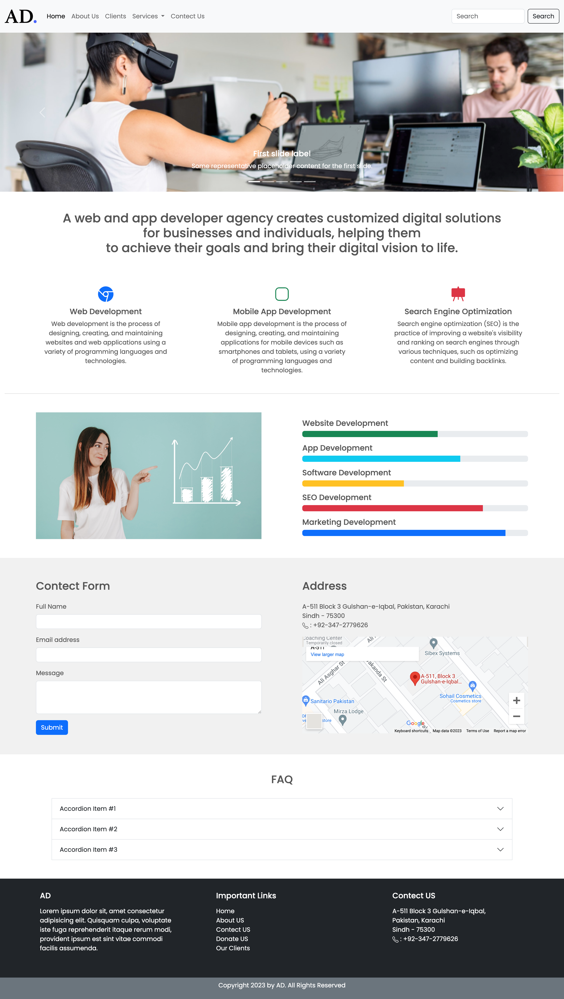

# BootStrap 5 Project 1

## Referance link: https://youtu.be/QE5oQh63gGE

"I'm excited to share my first Bootstrap 5 project, which I built entirely using Bootstrap code. This was a great opportunity for me to learn and practice using Bootstrap, and I'm proud of the results. The framework made it easy for me to create a responsive and modern design, and I look forward to using Bootstrap in future projects. I hope this project can serve as a helpful resource for others who are also learning Bootstrap 5."

Check here: https://zainahmed0597.github.io/bootstrap_project1/

